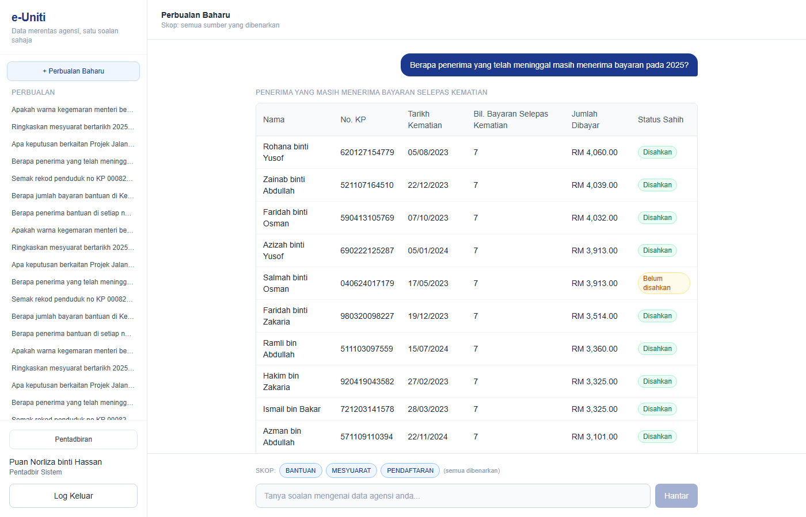
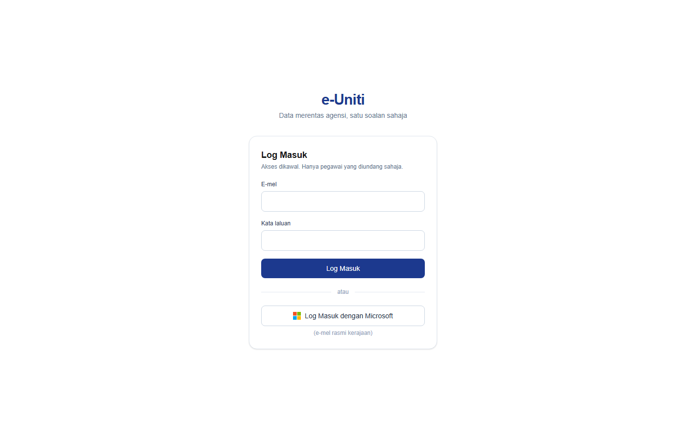
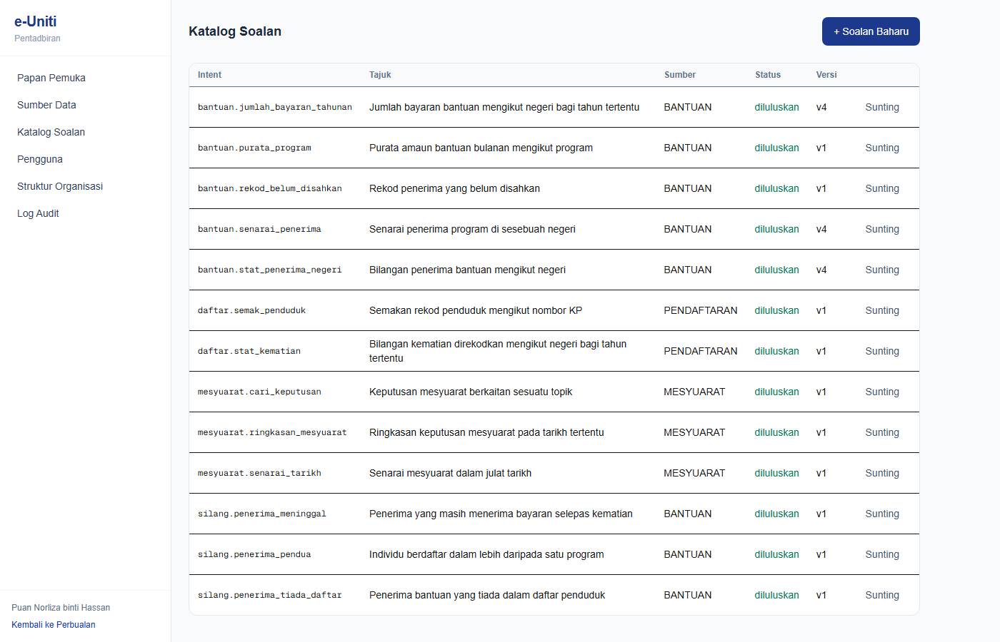
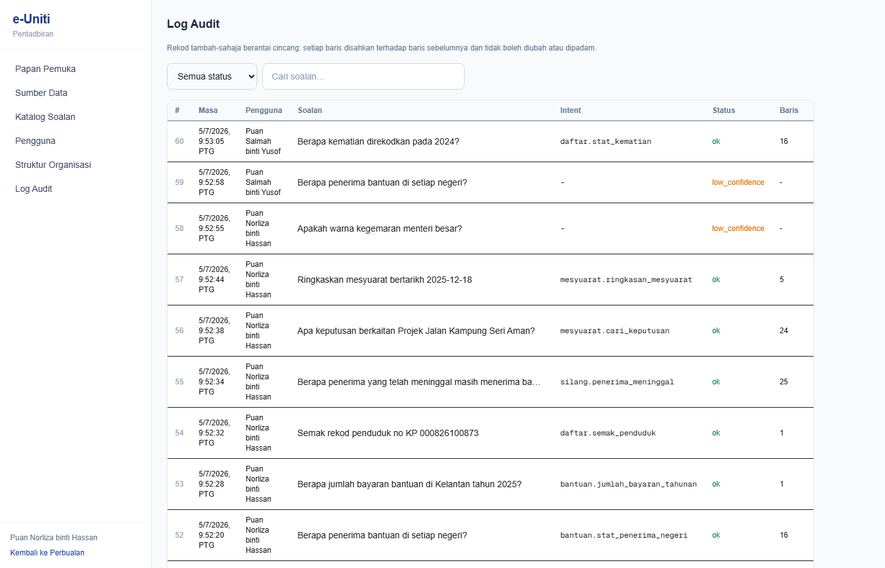

# e-Uniti (showcase)

**Live demo: https://e-uniti.vercel.app**

Cross-agency data access through a governed chat interface. Officers ask
questions in Bahasa Melayu; the system answers with a database-true table, a
short AI-written summary, and a provenance footer that cites the source
department, who entered the data, when, and its verification status. Every
question, whatever the outcome, is recorded in an append-only, hash-chained
audit log.

This repository is a showcase: screenshots, a design summary, and the live
demo link. It intentionally contains no source code.

## Try the demo

Open **https://e-uniti.vercel.app** and sign in with a demo account:

| Account | Password | Role |
|---|---|---|
| pentadbir@demo.gov.my | DemoAdmin#2026 | Admin (full access + admin console) |
| pegawai.kanan@demo.gov.my | DemoPegawai#2026 | Officer (all three data sources) |
| pegawai.jpn@demo.gov.my | DemoPegawai#2026 | Officer (registry only, for the access-control demo) |

Questions to try (Bahasa Melayu):

- *Berapa penerima bantuan di setiap negeri?* (statistics across a department)
- *Berapa penerima yang telah meninggal masih menerima bayaran pada 2025?*
  (a cross-check between two departments, the parliament scenario)
- *Apa keputusan berkaitan Projek Jalan Kampung Seri Aman?* (full-text search
  over meeting minutes)
- *Ringkaskan mesyuarat bertarikh 2025-12-18* (search and summarize)

Ask questions at a human pace: the demo runs on free AI tiers with per-minute
limits.

All data in the demo is generic and fictional.

## What makes it gov-grade, not a chatbot

**The AI never writes SQL.** Instead of turning a question into a database query
(which a free model would get wrong, and which is unsafe), the AI only picks
from a catalog of pre-approved, read-only questions that each department has
authored and approved, and extracts typed parameters. The database query is a
reviewed, versioned artifact; the AI just classifies and narrates.

Consequences that matter to a government evaluator:

- **Prompt injection has zero blast radius.** The worst a manipulated prompt can
  do is select a different pre-approved, read-only query the user was already
  allowed to run, under audit.
- **Provenance on every row.** Source department, who keyed it, when, and a
  verification flag; unverified data is visibly labelled or excluded. A figure
  can be quoted with its source.
- **Access is explicit and revocable.** Invite-only accounts, per-user grants
  per data source, checked twice per request.
- **The audit log is evidence.** Append-only and hash-chained, so it cannot be
  edited after the fact, and it records the system's own failures too.
- **Data sovereignty.** The AI layer is swappable to a model running inside the
  government network, with no data leaving the premises. No code changes, only
  configuration.

## Screenshots

| | |
|---|---|
|  |  |
| Invite-only login | The approved-question catalog (governance workflow) |

The append-only, hash-chained audit log records every question and its outcome.

## Design summaries

- [Architecture](docs/architecture-summary.md)
- [Security](docs/security-summary.md)

## Stack

Next.js on Vercel, Supabase (Postgres + invite-only auth), and an
OpenAI-compatible AI seam (Groq / Google Gemini in the cloud, or a fully
offline local model). Built to move from a free-tier demo to an on-premise
government install by configuration alone.
